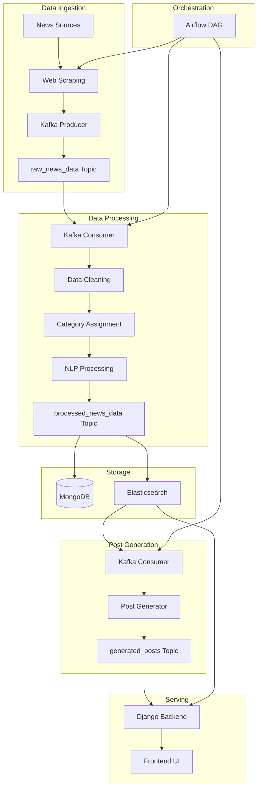

```mermaid
flowchart TB
    subgraph "Data Ingestion"
        I1[News Sources]
        I2[Web Scraping]
        I3[Kafka Producer]
        T1[raw_news_data Topic]
    end

    subgraph "Data Processing"
        P1[Kafka Consumer]
        P2[Data Cleaning]
        P3[Category Assignment]
        P4[NLP Processing]
        T2[processed_news_data Topic]
    end

    subgraph "Storage"
        S1[(MongoDB)]
        S2[Elasticsearch]
    end

    subgraph "Post Generation"
        G1[Kafka Consumer]
        G2[Post Generator]
        T3[generated_posts Topic]
    end

    subgraph "Serving"
        W1[Django Backend]
        W2[Frontend UI]
    end

    subgraph "Orchestration"
        O1[Airflow DAG]
    end

    I1 --> I2
    I2 --> I3
    I3 --> T1
    
    T1 --> P1
    P1 --> P2
    P2 --> P3
    P3 --> P4
    P4 --> T2
    
    T2 --> S1
    T2 --> S2
    S2 --> G1
    
    G1 --> G2
    G2 --> T3
    
    T3 --> W1
    S2 --> W1
    W1 --> W2
    
    O1 --> I2
    O1 --> P1
    O1 --> G1
```